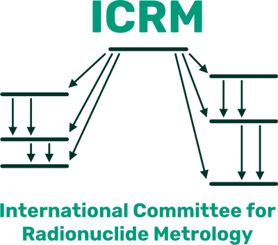

{: .float-left .pr-6 .d-flex #logo-home}

The International Committee for Radionuclide Metrology (ICRM) is an association
of radionuclide metrology laboratories whose membership is composed of delegates
of these laboratories together with other scientists (associate members)
actively engaged in the study and applications of radioactivity. It explicitly
aims at being an international forum for the dissemination of information on
techniques, applications and data in the field of radionuclide metrology. This
discipline provides a range of tools for tackling a wide variety of problems in
numerous other fields, for both basic research and industrial applications.
Radionuclide metrology continues to play an important role in the nuclear
industry, supporting activities such as radionuclide production, nuclear
medicine, measurement of environmental radioactivity and of radionuclides in
food and drinking water, decommissioning of nuclear facilities, nuclear security
and emergency preparedness, nuclear physics research, etc.
{: .py+4 }

Plenary meetings of the ICRM are held biennially and have developed into
scientific ICRM conferences, a successful instrument of communication among
various specialists, truly encouraging international co-operation. The most
recent in the series of ICRM meetings, the "24th International Conference on
Radionuclide Metrology and its Applications, ICRM 2025" was held from 19 to 22 May, 2025 in Paris, France, and was hosted by 
the Laboratoire
National Henri Becquerel (LNE-LNHB).

Several ICRM working groups held interim meetings, virtually or in person,
in 2024, which offered ample opportunity to discuss technical details
of specific sub-fields of radionuclide metrology more informally. ICRM member
institutions are strongly encouraged to give young researchers the possibility
to participate in such interim meetings. For details, contact the Working Group
coordinators.

The most recent ICRM *Low-Level Radioactivity Measurement Techniques
Conference*, ICRM-LLRMT 2022, was organized by the Low-Level Measurement
Techniques Working Group (LLRMT) and hosted by the INFN-LNGS at the Gran Sasso
National Laboratory in Assergi (Italy), 2–6 May 2022. The Conference Proceedings
have been published in a [special issue of *Applied Radiation and Isotopes*](https://www.sciencedirect.com/journal/applied-radiation-and-isotopes/vol/194/suppl/C#article-36).
The next Conference will be organized in 2026.

The ICRM Life Sciences Working Group (LS-WG) meeting
on 8–9 June 2026 was hosted by the National Research Council of Canada,
in Ottawa, Canada. The Liquid Scintillation Counting
Working group (LSC-WG) also met in Ottawa (on 11–12 June). A visit to the
NRC laboratories took place during both meetings. 

The latest intermediate working meeting of the ICRM Gamma Spectrometry
Working Group was held on April 18–19, 2024 and was hosted by the CIEMAT
(Madrid, Spain).The ICRM Radionuclide Metrology Techniques (RMT) Working Group hosted its
interim meeting online 21 to 23 October 2024 (from 11:00 UTC to 15:00 UTC each
day), with digital electronics discussed on 21 October, coincidence counting
on 22 October, and gas counting and cryogenic calorimetry on 23 October.

