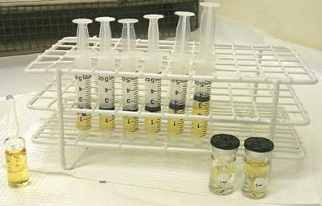

## Life Sciences Working Group

The purpose of the Life Sciences Working Group is to provide a forum for ICRM
members to address radionuclide metrology issues as they relate to the life
sciences. Issues may include, but are not limited to: development of
methodologies to calibrate short-lived radionuclides of interest in nuclear
medicine, measurement of decay properties (half-lives, decay energies and
probabilities, etc.) of radionuclides used in nuclear medicine and biological
research, development of measurement methodologies for transferring National
Measurement Standards to the clinic and research laboratory, and development of
methods to perform radioactivity assays of brachytherapy sources. The Working
Group will facilitate finding solutions to these problems through workshops,
publications, electronic communications (i.e., email), and collaborative work.
The Coordinator will maintain communication links between the members and will
periodically report to the group new issues and advancements in the field.

