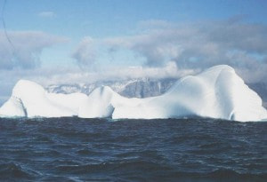

# Low Level Measurement Techniques Working Group

{: .chair }
**Daniel Zapata**\
<daniel.zapata@ptb.de>\
Physikalisch-Technische Bundesanstalt (PTB), Bundesalle 100, D-38116
Braunschweig, Germany

{: .chair }
**Begoña Quintana-Arnés**\
<quintana@usal.es>\
Catedrática de Física Atómica, Molecular y Nuclear Laboratorio de Radiaciones
Ionizantes y Datación, Edificio de I+D+i, c) Espejo 2, 37007-Salamanca, Spain

The ICRM working group for Low-Level Measurements Techniques (LLMT) examines
techniques to enable the detection of ever smaller amounts of radioactivity.
This enables, for example, collecting smaller samples and realising new
applications involving radionuclides. The working group focuses on metrology and
the latest developments in a variety of areas, including measurement of
environmental radioactivity, radionuclides in food and drinking water, reference
materials characterisation, tracer studies and nuclear physics research.
Conference proceedings are published in refereed scientific journals.

The most recent ICRM — Low-Level Radioactivity Measurement Techniques
Conference, ICRM-LLRMT 2022, was organized by the Low-Level Measurement
Techniques Working Group (LLRMT) and hosted by the INFN-LNGS at the Gran Sasso
National Laboratory in Assergi (Italy), 2–6 May 2022. The Conference Proceedings
have been published in a [special issue of Applied Radiation and
Isotopes](https://www.sciencedirect.com/journal/applied-radiation-and-isotopes/vol/194/suppl/C#article-36).

The next Conference will be organized in 2026.

## QA near decision threshold (etc.)

Subgroup{: .label }

{: .chair }
**M. Korun**\
<matjaz.korun@ijs.si>\
Jožef Stefan Institute (JSI), Jamova cesta 39, 1000 Ljubljana, Slovenia

