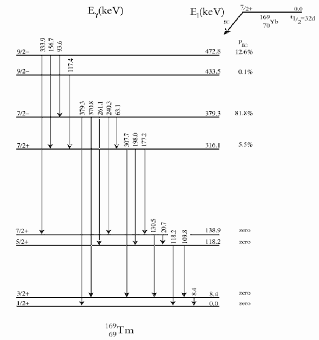

## Nuclear Decay Data Working Group

<http://www.lnhb.fr/home/conferences-publications/icrm_ndd_wg/>

The Nuclear Decay Data Working Group (3NDWG) facilitates awareness and
communications between ICRM members interested in the measurement, calculation,
compilation and evaluation of decay data, and the maintenance of computer-based
decay data files (e.g., half-lives; energies and emission probabilities of alpha
particles, beta particles, gamma rays, x-rays, conversion electrons and Auger
electrons; internal conversion coefficients; transition types; and other
relevant parameters, including uncertainties).

Members of the 3NDWG are encouraged to use the Working Group to communicate
experimental and theoretical work, relevant evaluation procedures, their decay
data problems, and to establish methodologies that are fully consistent with the
satisfactory production of recommended decay data.

The 3NDWG Coordinator strives to maintain satisfactory links between all active
members to achieve the primary aim (see above), and to inform them of all
relevant activities identified with the creation and maintenance of decay-data
files.

