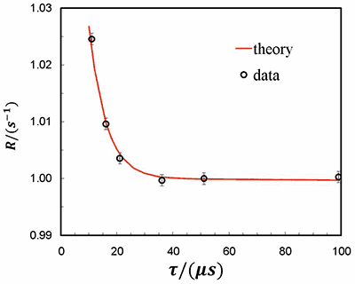

## Radionuclide Metrology Techniques Working Group

The ICRM Radionuclide Metrology Working Group (RMT-WG) consists of experts in
the field of radionuclide metrology. Meetings of the RMT-WG are held
approximately annually as a forum for practitioners to share ongoing
developments, gain input from peers on challenges, and work together to address
common needs. Historically, a focus has been on 4πβ-γ coincidence counting, and
its variants. More recently, that topic has broadened to address the metrology
of counting for a variety of measurement methods, and especially the many
aspects of absolute counting using digital electronics, which has become an
RMT-WG subgroup. Radioactive gas counting and large area source measurements are
also fields of significant interest to become subgroups of RMT-WG. The RMT-WG
covers other topics important to the radionuclide metrology community, from
quantitative source preparation to informing the community about proper
citations in manuscripts. To this end, the RMT-WG liaises with other ICRM WGs,
the CCRI (II) and its WGs, the BIPM, and other stakeholders.

