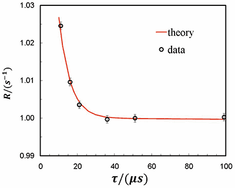

# Radionuclide Metrology Techniques Working Group

{: .coordinator }
**R. Fitzgerald**\
<ryan.fitzgerald@nist.gov>\
Physical Measurement Laboratory, National Institute of Standards and
Technology (NIST), Gaithersburg, Maryland, 20899–8462, U.S.A.

{: .coordinator }
**C. Bobin**\
<Christophe.bobin@cea.fr>\
Laboratoire National Henri Becquerel (LNE-LNHB), CEA-Saclay, F-91191
Gif-sur-Yvette Cedex, France

{: .subgroups }
[Digital Coincidence Counting](./dcc.html)\
[Internal Gas Counting](./gas-counting.html)\
[Large Area Sources](./large-area.html)

The ICRM Radionuclide Metrology Working Group (RMT-WG) consists of experts in
the field of radionuclide metrology. Meetings of the RMT-WG are held
approximately annually as a forum for practitioners to share ongoing
developments, gain input from peers on challenges, and work together to address
common needs. Historically, a focus has been on 4πβ-γ coincidence counting, and
its variants. More recently, that topic has broadened to address the metrology
of counting for a variety of measurement methods, and especially the many
aspects of absolute counting using digital electronics, which has become an
RMT-WG subgroup. Radioactive gas counting and large area source measurements are
also fields of significant interest to become subgroups of RMT-WG. The RMT-WG
covers other topics important to the radionuclide metrology community, from
quantitative source preparation to informing the community about proper
citations in manuscripts. To this end, the RMT-WG liaises with other ICRM WGs,
the CCRI (II) and its WGs, the BIPM, and other stakeholders.

**2024 RMT-WG Meeting: Pedagogical Presentations**

- [Cox-Isham-Smith β-γ coincidence rate correction, Youcef Nedjadi (CHUV)](./files/Cox-Isham-Smith%20b-g%20coincidence%20rate%20correction%20Nedjadi.pdf)
- [Application of Müller EDT formulae to 4πβ(LS)-γ coincidence counting, Haoran LIU (NIM)](./files/Application%20of%20Muller%20EDT%20formulae%20to%204pbLS-γ%20coincidence%20counting%20at%20NIM%20LIU.pdf)
- [Overview of the IMPECC system for 4πβ-γ coincidence counting at LNHB, Christophe Bobin (CEA/LNHB)](./files/Overview%20of%20the%20IMPECC%20system%20for%204pb-g%20coincidence%20counting%20at%20LNHB%20Bobin.pdf)
