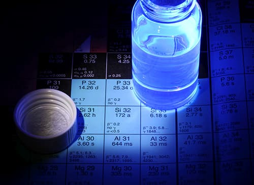

## Liquid Scintillation Counting Working Group

<http://www.lnhb.fr/home/conferences-publications/icrm_lsc_wg/>

The purpose of the Liquid Scintillation Counting Working Group is to provide a
forum for ICRM members to address issues related to liquid scintillation and
Čerenkov counting. In particular, the CIEMAT/NIST efficiency tracing and the
Triple-to-Double-Coincidence Ratio (TDCR) methods play major roles in
Radionuclide Metrology. In the past two decades, many new developments were
presented by ICRM researchers, e.g., new counter systems, new electronics for
signal treatment and data acquisitions, investigations of existing models and
extensions of calculation procedures. These methods are used for activity
standardization of a growing number of radionuclides as well as for
determination and validation of radionuclide decay data.

